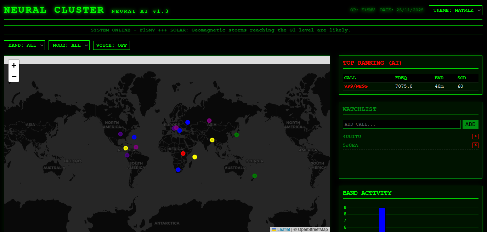

# 📡 DX Cluster Watcher (v7.3 ULTIMATE)

Un moniteur de DX Cluster en temps réel pour Radioamateurs, écrit en Python.
Il se connecte aux clusters via Telnet, analyse les spots, et les affiche sur un tableau de bord Web moderne avec cartographie, infos solaires, flux RSS et alertes vocales.



## ✨ Fonctionnalités

*   **Connexion Telnet Robuste :** Connexion permanente avec reconnexion automatique et gestion de "Failover" (bascule sur un serveur de secours si le principal tombe).
*   **Interface Web (Dashboard) :** Carte du monde dynamique, liste des spots en temps réel, statistiques par pays.
*   **Synthèse Vocale (TTS) :** Annonce audio automatique des nouveaux spots DX (ex: "New Spot: Japan on 20 meters").
*   **Enrichissement des données :** Résolution automatique des pays et coordonnées via `cty.dat` (mis à jour automatiquement).
*   **Infos Propagation :** Récupération des données solaires (Flux, A-Index) via NOAA.
*   **News Radioamateur :** Fil d'actualité intégré via flux RSS (DX Zone, etc.).
*   **Filtres Intelligents :** Détection automatique des modes (CW, SSB, FT8, RTTY) et des bandes.
*   **chart en couleurs suivants les bandes

## 📂 Structure des Fichiers (IMPORTANT)

Pour que l'interface Web fonctionne, **la structure des dossiers doit être respectée scrupuleusement** :

```text
/votre-dossier-projet/
│
├── webapp.py            # Le script principal (Moteur + Serveur Web)
├── templates/           # ⚠️ DOSSIER OBLIGATOIRE pour Flask
│   └── index.html       # L'interface Web (HTML/JS/CSS)
│
├── capture.png          # Capture d'écran pour le README (optionnel)
├── cty.dat              # Base de données pays (téléchargé automatiquement)
└── README.md            # Ce fichier
🚀 Installation
1. Pré-requis
Vous devez avoir Python 3 installé sur votre machine (Raspberry Pi, Linux, Windows, Mac).

2. Installation des dépendances
Ce projet nécessite Flask pour le serveur web et feedparser pour les news RSS.

pip install flask feedparser
3. Configuration
Ouvrez le fichier webapp.py et modifiez la variable suivante au début du fichier pour mettre votre indicatif :

MY_CALL = "F1SMV"  # Remplacez par votre indicatif
Vous pouvez aussi modifier la liste CLUSTERS si vous préférez d'autres serveurs Telnet.

▶️ Démarrage
Lancez le script depuis votre terminal :

python3 webapp.py
Ou si vous avez un script de démarrage :

./start.sh
Une fois lancé :

Le terminal affichera les logs de connexion et les spots reçus ([SPOT] ...).
Ouvrez votre navigateur web à l'adresse : http://IP_DE_VOTRE_MACHINE:8000
Exemple : http://192.168.1.76:8000 ou http://localhost:8000
(Note : Assurez-vous que la dernière ligne de webapp.py indique bien port=8000)

🛠 Dépannage
Erreur "TemplateNotFound: index.html" :
Vous avez oublié de créer le dossier templates ou de mettre index.html à l'intérieur. Vérifiez la structure des dossiers ci-dessus.

Pas de son (Synthèse vocale) :
La synthèse vocale dépend de votre navigateur. Assurez-vous d'avoir cliqué au moins une fois n'importe où sur la page pour autoriser l'audio (politique de sécurité des navigateurs modernes).

Pas de spots qui s'affichent :
Attendez quelques secondes après le lancement. Le script force l'affichage des 20 derniers spots (show/dx 20) au démarrage pour remplir le tableau immédiatement.

Erreur de port (Address already in use) :
Le script utilise le port 8000 par défaut. Si ce port est pris par une autre application, modifiez la dernière ligne de webapp.py ou tuez l'ancien processus.

📜 Crédits & Version
Version : v7.2-HYBRID
Date : 23/11/2025
Pensé apr F1SMV réalisé par GIMINI 3
Licence : Open Source - Pour usage radioamateur.