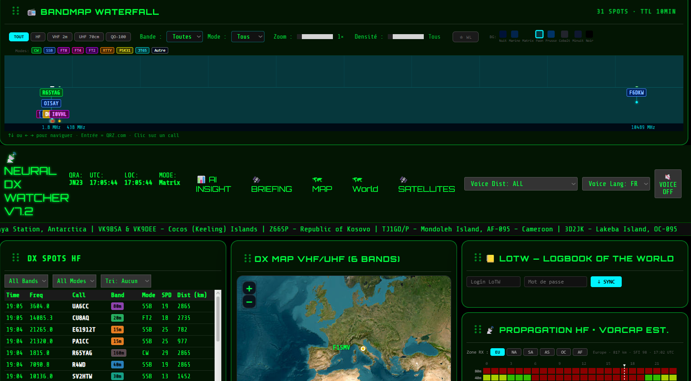

📡 DX Cluster Dashboard – v4.6 (Neural AI Edition)

Dashboard web temps réel nouvelle génération pour radioamateurs, piloté par un moteur d'analyse statistique et connecté à un DX Cluster via Telnet.

Conçu pour la veille DX proactive, la visualisation géographique avancée, et l'optimisation de propagation.
🚀 Quoi de neuf dans la v4.6 ?

Cette version introduit le label "Neural AI", ajoutant une couche d'intelligence et d'analyse aux données brutes du cluster :
🧠 Moteur de Score SPD (Spot Priority/Difficulty)

    Attribution d'un score de 0 à 100 pour chaque spot basé sur la rareté du préfixe, le mode (bonus CW), la distance et les commentaires (Split, Up, DX).

    Identification immédiate des stations "Wanted" (Score > 70).

🗺️ AI Path Optimizer & Grayline

    Visualisation de trajet : Calcul et affichage du trajet optimal vs trajet long (Long Path) pour chaque spot.

    Analyse de propagation : Recommandations basées sur la Grayline pour éviter l'absorption ionosphérique.

📊 Statistiques DXCC 24h & Rareté

    Nouveau tableau de bord analytique incluant :

        Nombre d'entités DXCC uniques contactées/vues en 24h.

        Taux de rareté global (Rarity Rate %).

        Liste dynamique des calls "Longue Distance" (> 10 000 km).

🌠 Monitoring Meteor Scatter (MS)

    Intégration du calendrier des essaims météoritiques (Perséides, Léonides, etc.).

    Détection automatique d'activité MSK144 sur 2m avec alertes de "Surge" dédiées.

🛠️ Fonctionnalités Historiques
🔗 Connectivité Cluster

    Connexion Telnet persistante multi-source (dxfun.com, cluster.dx.de, etc.) avec reconnexion auto.

    Envoi de spots manuels directement depuis l'interface.

☀️ Données Solaires NOAA

    Récupération en temps réel des indices SFI, A et K depuis les serveurs de la NOAA.

    Export des données solaires via API aux formats XML et JSON.

🗣️ Synthèse Vocale & Alertes

    Annonce vocale multilingue (FR, EN, ES, HE) des nouveaux spots.

    Gestion d'une Watchlist personnalisée avec notifications visuelles.

📊 Interface Modulaire

    Dashboard en colonnes avec pavés Drag & Drop.

    Histogrammes d'activité sur 12 heures par bande.

🧠 Architecture Technique

    Backend : Python 3.x / Flask

    Traitement : Multithreading (Workers dédiés pour Telnet, Solaire, RSS et Statistiques).

    Frontend : HTML5 / JavaScript Vanilla / Leaflet (Cartographie).

    Bases de données : Géolocalisation via cty.dat (mise à jour auto) et watchlist.json.

Nouvelles Routes API v4.6 :

    /dxcc_stats_24h.json : Données analytiques journalières.

    /ai_path_data.json : Coordonnées pour l'optimiseur de trajet.

    /api/solar.xml : Flux XML des données solaires pour intégration tierce.

📸 Aperçu

(Légende : Visualisation des spots avec scores SPD et trajectoires AI)
🛠️ Installation
Bash

# Cloner le dépôt
git clone https://github.com/Eric738/Spot-Watcher-DX.git
cd Spot-Watcher-DX

# Créer l'environnement virtuel
python3 -m venv venv
source venv/bin/activate  # Sur Windows: venv\Scripts\activate

# Installer les dépendances
pip install -r requirements.txt

# Lancer l'application
python webapp.py

Puis ouvrez votre navigateur sur : http://localhost:8000
🧩 Évolutions à venir

    [ ] Intégration réelle du moteur de corrélation cognitive (Pattern Matching).

    [ ] Export des logs au format ADIF pour carnet de trafic.

    [ ] Heatmap de propagation basée sur le rapport signal/bruit (si disponible via cluster).

Développé par F1SMV Eric avec l'assistance de Gemini/ChatGPT pour la communauté Radioamateur.

73's et bon DX !