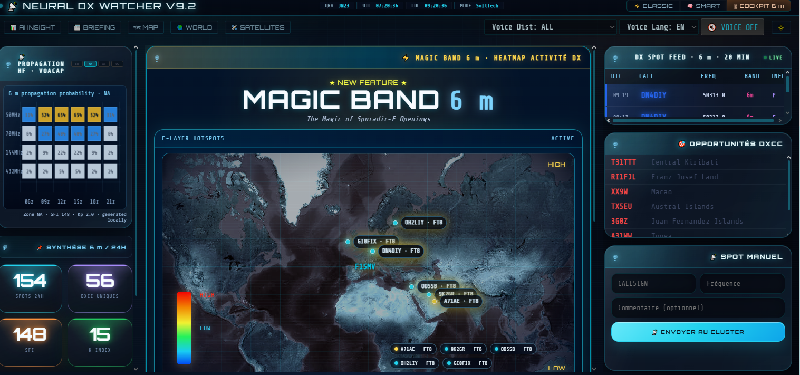

# 📡 Radio Spot Watcher DX — v7.2

**DX Cluster Dashboard & Advanced Radio Analysis Engine**

Application web locale de surveillance DX et d'analyse radio destinée aux radioamateurs exigeants.  
Conçue pour **observer**, **comprendre** et **prendre du recul** — pas pour faire du bruit visuel.

---

## 🧭 Présentation générale

**Radio Spot Watcher DX** est une application web locale qui :

- se connecte à un ou plusieurs **DX Clusters (Telnet)**
- affiche les **spots en temps réel** (HF / VHF / UHF)
- intègre les **indices solaires** (SFI, A, Kp…)
- conserve une **mémoire exploitable** de l'activité
- propose **plusieurs niveaux de lecture**, du live à l'analyse stratégique

> L'objectif n'est pas de voir beaucoup,  
> mais de **voir juste**.

---

## 🖥️ Pages principales

### 1️⃣ Page **Index** — Temps réel & suivi opérateur

Page d'observation immédiate.

Elle affiche :
- le flux de spots en direct
- les bandes actives
- les DX recherchés (*wanted*)
- les indices solaires
- les signaux de **surge** d'activité

👉 **Objectif : savoir ce qui se passe maintenant.**

---

### 📡 Pavé **WATCHLIST · Tracking**

Fonction introduite pour répondre à un besoin simple :

> *« Je n'étais pas devant l'écran : qu'ai-je raté ? »*

- basé sur la watchlist
- exploite un historique en mémoire
- affiche les derniers spots par indicatif

Philosophie :
- ❌ pas un log brut
- ❌ pas un dump massif
- ✅ un outil de rattrapage
- ✅ pensé pour l'opérateur humain

---

### 2️⃣ Page **Map** — Carte d'observation (micro-lecture)

Carte classique des **spots individuels** :

- chaque point = **une station**
- représentation géographique immédiate
- vision instantanée

👉 **Objectif : voir où ça se passe.**

La page **Map** est un **outil d'exécution**.

---

### 3️⃣ Page **Analyse** — META ANALYSE différée

Outil volontairement **non temps réel**, basé sur l'analyse du log applicatif.

👉 **Outil de recul**, pas un gadget.

---

### 4️⃣ Page **World** — Forecast & Anomalies

La page **World** est **fondamentalement différente** de la page Map.

| Page | Nature | Question |
|---|---|---|
| Map | Observation brute | Qui est actif maintenant ? |
| World | Analyse interprétée | Où la propagation est anormalement favorable ? |

- affichage de **zones**, pas de stations
- clustering spatio-temporel
- filtrage du bruit
- rafraîchissement contrôlé

👉 **World décide, Map exécute.**

### 5️⃣ Page **Briefing**

Se met à jour toutes les 12 heures, reprenant les infos DX essentielles. Possibilité d'ajouter automatiquement les calls dans la watchlist de la page Index. Vous ne raterez aucune expédition : dès qu'un call est spotté, il s'affiche en jaune dans le pavé DX spots.

---

📸 Aperçu

## ⚙️ Architecture technique

- Backend : Python / Flask
- Frontend : HTML / CSS / JavaScript
- Cluster : Telnet DX Cluster
- Analyse : scripts Python dédiés
- Stockage : mémoire + JSON locaux

Aucune dépendance cloud.

---

### 🗂️ Historique des versions

### v7.2 — Satellite Tracker

- Nouvelle page **Satellite Tracker** : suivi temps réel de satellites amateur (AO-73, AO-91, ISS, RS-44, SO-50, FO-29, PO-101…)
- Positions calculées localement via **sgp4** depuis les TLE AMSAT
- Carte **Leaflet** avec footprint de couverture par satellite
- Tableau élévation / azimut / altitude en temps réel
- Pavé **Prochains passages** (24h UTC) : AOS, TCA, LOS, durée, élévation max
- Sélection multi-satellite indépendante pour les passages
- Mise à jour manuelle des keps depuis CelesTrak
- Gestion du catalogue AMSAT : ajout/suppression de satellites suivis

### v7.1

**LoTW — Opportunités DXCC**

- Croisement automatique du log LoTW avec les expéditions DX à venir (horizon 21 jours)
- Section **🎯 OPPORTUNITÉS DXCC — 21 JOURS** dans le pavé LoTW, classée par priorité :
  - 🔴 NOUVEAU DXCC — pays jamais travaillé
  - 🟡 NON CONFIRMÉ — travaillé mais pas de QSL LoTW
  - 🔵 BANDE MANQUANTE — confirmé mais des bandes restent à faire
- Compte à rebours J-X avant la fin de chaque expédition
- Résolution automatique des dates depuis le texte du briefing

**Page Briefing entièrement refaite**

- Un seul rendu unifié pour toutes les sources (fini les trois sections redondantes)
- Pavés **drag & drop** : réorganisables librement, ordre mémorisé en localStorage
- Parser NG3K réécrit pour le format texte structuré — filtre automatique des expéditions terminées
- Titre structuré : `Callsign · DXCC · → date de fin`
- Callsigns surlignés en cyan dans tous les résumés
- Horodatage relatif (il y a 2h, il y a 3j…)
- Correction du warning `datetime.utcnow()` Python 3.12

### v7.0 — Intégration LoTW & améliorations bandmap

**Intégration LoTW (Logbook of the World)**

- Connexion sécurisée depuis l'interface web — identifiants jamais stockés sur le disque
- Import complet de votre log : tous les QSOs uploadés + QSLs confirmées
- Résolution DXCC via `cty.dat` (pas de dépendance au champ ADIF optionnel)
- Statistiques : QSOs totaux, QSLs confirmées, DXCC confirmés par bande (barres visuelles)
- **Dans les spots HF et VHF** : fond rouge + badge NEW = DXCC jamais travaillé / fond vert + ✓ = DXCC déjà confirmé
- **Bouton ★ NEW DXCC** dans les pavés HF et VHF pour filtrer uniquement les nouveaux DXCC
- **Dans la watchlist** : badge NEW DXCC ou ✓ LoTW sur chaque call
- Spinner de chargement pendant la synchronisation (30–60s pour un gros log)

**Bandmap**

- Zoom porté à 100× pour les bandes chargées (ex. 20m)
- Couleur des étiquettes par mode : CW (vert), SSB (bleu), FT8 (violet), FT4 (rose), FT2 (mauve), RTTY (orange), PSK31 (jaune), JT65 (cyan)
- Légende des modes affichée dans les contrôles
- Axe des fréquences : uniquement les vraies limites de bandes radioamateur
- Pan à la souris (clic + glisser) même à zoom 1×
- Persistance de tous les réglages via localStorage

### v6.9

- Pavé VOACAP : prédiction de propagation HF locale (sans dépendance cloud)
- Endpoint `/api/voacap?zone=EU` — calcul MUF/LUF/REL depuis SFI et Kp
- Zones : EU / NA / SA / AS / OC / AF
- Grille colorée bandes × heures UTC style VOACAP
- Zone préférée sauvegardée en localStorage

### v6.8

- Palette de couleurs pour le fond de la bandmap (8 thèmes, persisté)
- Zoom jusqu'à 100× sur la bandmap
- Couleur des pins selon le mode spotté

### v6.7

- Vérification des mises à jour GitHub toutes les 24h (anti rate-limiting)
- Bouton WL pour n'afficher que les stations de la watchlist dans la bandmap
- Filtres HF / VHF 2m / UHF 70cm / QO-100 dans la bandmap
- Correction bug affichage page Analyse

### v6.6

- Bandmap : curseurs zoom et filtre densité SPD
- Recentrage automatique sur le call sélectionné

### v6.5

- Remplacement de `telnetlib` par `telnetlib3` (suggestion F5UGQ)
- Brief vocal IA via bouton dans le pavé Solar Indices (API Perplexity, ~0.01€/appel)

### v6.4

- Ajout de la bandmap sur la page d'accueil, sélection par bande et mode

### v6.3

- Tri par fréquences dans les pavés DX HF et VHF
- Bandeau de notification de mise à jour

### v6.2

- Ajout optionnel des calls dans la watchlist
- Support du mode FT2

### v6.1

- Nouvelle page Briefing DXpéditions
- Modification des cartes de la page Index

### v6.0 — Release stable

- Finalisation de la page World
- Séparation claire Map / World
- Clustering stabilisé
- Rafraîchissement automatique
- UX clarifiée
- Sauvegarde état utilisateur

> Passage de v5.7 à v6.0 dû à plusieurs versions d'essai non publiées.

### v5.7 — Versions de travail

- Prototypes World
- Ajustements de scoring
- Corrections structurelles

### v5.6

- Introduction de World (expérimentale)
- Pavé WATCHLIST · Tracking

### v5.2

- Introduction de la META ANALYSE

---

## 👤 Auteur

Développé par **F1SMV – Eric**  
avec l'assistance de Claude (Anthropic)  
au service de la communauté radioamateur.  
Contact : @f1smv sur X
